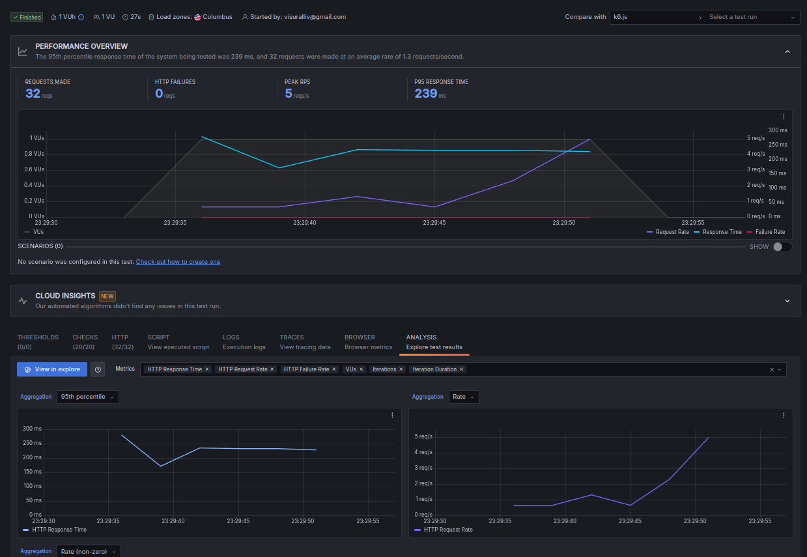

Разработан API интерфейс на базе Spring Framework, методы позволяют создавать до 10 элементов закрытых и объединенных
интервалов, а также управлять списком просмотр и удаление (list, clear). Бизнес логика вынесена на уровень сервисов,
@TODO
- добавить классы запросов
- добавить классы ответов 
- добавить репозиторий для работы с данными

# Запуск

java -Xms512m -Xmx1024m  -jar target/interval-0.1.0.jar

# Docker 
docker build -t interval-api .

docker run -p 8080:8080 interval-api

# Doc
OpenAPI Specification
http://localhost:8080/swagger-ui/index.html

# Добавить замкнутый интервал
curl -X POST "http://localhost:8080/api/addClosedInterval?x1=2.0&x2=5.0"

# Добавить объединенный интервал
curl -X POST "http://localhost:8080/api/addOpenInterval?x1=3.0&x2=7.0"

# Получить пересечения интервалов
curl -X GET "http://localhost:8080/api/getIntersections"

# Найти ближайшее число
curl -X GET "http://localhost:8080/api/findClosest?x=6.0"

# Получить весь список
curl -X GET "http://localhost:8080/api/list" |jq

# Очистить список
curl -X GET "http://localhost:8080/api/clear" |jq

# Test
k6 run k6.js

# Логика:

- Сбор точек из концов интервалов:
Вместо создания множества промежуточных точек, мы собираем только концы каждого интервала (начало и конец).
- Сортировка точек:
Мы сортируем точки перед применением бинарного поиска. Сортировка имеет временную сложность (O(n \log n)).
Применение бинарного поиска:
Метод binarySearchClosest ищет ближайшее значение к целевому значению с использованием бинарного поиска. Это имеет временную сложность (O(\log n)).

# Основные шаги бинарного поиска:
- Инициализация границ поиска:
Устанавливаем начальные значения для low и high, которые указывают на начало и конец массива соответственно.
- Цикл поиска:
Пока low меньше или равно high, выполняем следующие шаги:
- Вычисляем средний индекс mid:
Используем формулу mid = low + (high - low) / 2, чтобы избежать переполнения.
Сравниваем значение в середине массива points[mid] с целевым значением target:
Если points[mid] равно target, возвращаем points[mid], так как точное совпадение найдено.
Если points[mid] меньше target, то целевое значение находится в правой половине массива, и мы устанавливаем low = mid + 1.
Если points[mid] больше target, то целевое значение находится в левой половине массива, и мы устанавливаем high = mid - 1.
- По завершении цикла:
После выхода из цикла, если точное совпадение не найдено, необходимо определить, какое из ближайших значений (на границах поиска) ближе к целевому значению.

# Временная и пространственная сложность:
- Временная сложность метода findClosest:
Сбор точек: (O(n)).
Сортировка точек: (O(n \log n)).
Бинарный поиск: (O(\log n)).
Итоговая временная сложность: (O(n \log n)).
- Пространственная сложность:
Список точек: (O(n)).